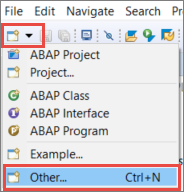
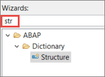
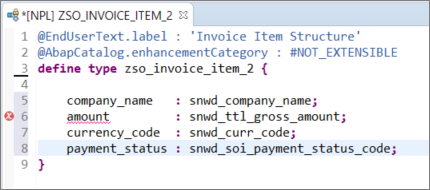

# Create a New ABAP Dictionary Structure Test Green
<!-- description --> Create an ABAP Dictionary structure for retrieving data from a database

## Prerequisites  
 - You have a valid instance of an on-premise AS ABAP server, version 7.51 or higher (some ABAP Development Tools may not be available in earlier versions)
 - **Tutorial**: [Create an ABAP Project in ABAP Development Tools (ADT)](abap-create-project)

## You will learn  
- How to create an Data Dictionary structure

---

### Create a global Data Dictionary structure


Now, you will create a global Data Dictionary ("DDIC") structure: In the toolbar, select **New**, then choose **Other ABAP Repository Object**.




### Filter the list of object types


In the wizard that appears, filter the list of ABAP repository object types by entering `**struct**`.




### Enter name and description


Then enter the following and choose **Finish**.
- Name = **`ZSO_INVOICE_ITEM`**
- Description = for example, **Invoice item structure**


A new text editor is opened showing the content of the newly created Data Dictionary structure.


### Remove the generated component


Remove the generated example component `component_to_be_changed` from the structure:


### Define fields for the structure


In the item structure, define the fields `company_name`, `amount`, `currency_code`, and `payment_status`, and assign them to the relevant data elements as follows:
```ABAP
  company_name   : snwd_company_name;
  amount         : snwd_ttl_gross_amount;
  currency_code  : snwd_curr_code;
  payment_status : snwd_soi_payment_status_code;

```



The editor shows a syntax error because the amount has not yet been bound to the currency code.


---
